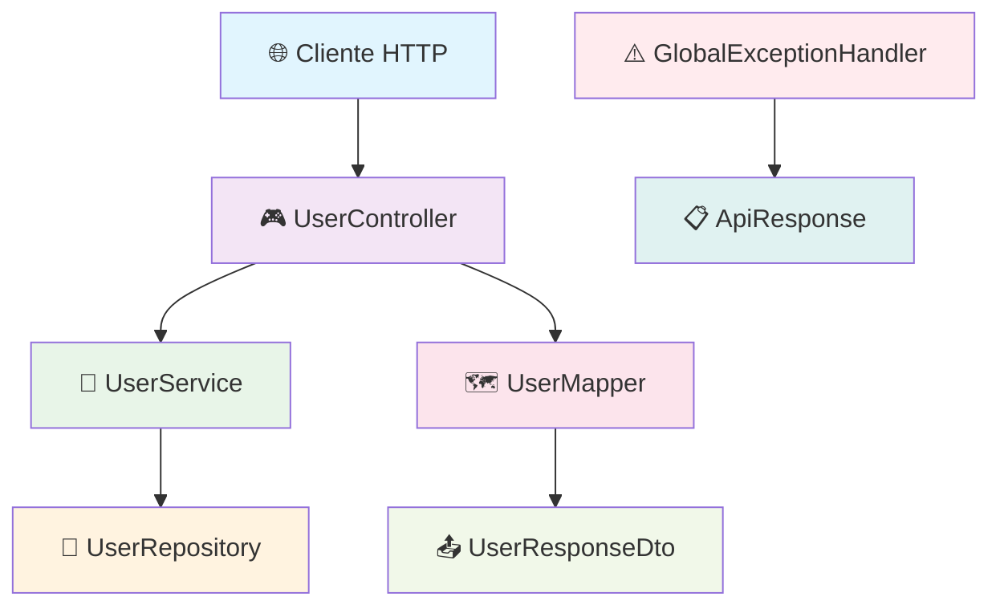

# 🚀 Actividad JaCoCo - Cobertura de Pruebas y Refactorización

<div align="center">


</div>

## 📋 Tabla de Contenidos

- [🎯 Objetivos](#-objetivos)
- [✅ Checklist de Buenas Prácticas](#-checklist-de-buenas-prácticas)
- [🔧 Actividad Realizada](#-actividad-realizada)
- [📊 Resultados de Pruebas](#-resultados-de-pruebas)
- [🏗️ Arquitectura Refactorizada](#️-arquitectura-refactorizada)
- [📈 Cobertura de Código](#-cobertura-de-código)
- [🚀 Cómo Ejecutar](#-cómo-ejecutar)
- [📝 Conclusiones](#-conclusiones)

## 🎯 Objetivos

### ✨ Objetivos Principales

- **🔍 Identificar errores de calidad** - Detectar y corregir malas prácticas en el código existente
- **🔄 Refactorizar aplicando buenas prácticas** - Implementar principios SOLID, DRY y Clean Code
- **📋 Documentar y exponer resultados** - Crear documentación completa con métricas de cobertura

### 🎯 Objetivos Específicos

- Configurar JaCoCo para generar reportes de cobertura
- Implementar pruebas unitarias completas
- Aplicar patrones de diseño y arquitectura limpia
- Generar reportes visuales de cobertura

## ✅ Checklist de Buenas Prácticas

### ✅ Implementadas

- ✅ **Nombres claros en variables, métodos y clases**
- ✅ **Separación Controller/Service/Repository**
- ✅ **Eliminación de duplicidad de código**
- ✅ **Métodos cortos y una sola responsabilidad**
- ✅ **Validaciones con anotaciones**
- ✅ **Manejo centralizado de errores**
- ✅ **Evitar valores mágicos**
- ✅ **Pruebas unitarias básicas**

### 🔧 Mejoras Aplicadas

| Antes | Después |
|-------|---------|
| `public UserService service = new UserService()` | `@RequiredArgsConstructor` + Inyección por constructor |
| `System.out.println("Getting users...")` | `@Slf4j` + Logging profesional |
| `return "not found"` | `ResponseEntity<ApiResponse<T>>` |
| `public String name;` | `@Data` + campos privados + validaciones |
| Rutas inconsistentes (`/listAll`, `/del/{id}`) | API REST estándar (`/api/v1/users`) |

## 🔧 Actividad Realizada

### 1. 🏗️ Configuración de JaCoCo

```xml
<plugin>
    <groupId>org.jacoco</groupId>
    <artifactId>jacoco-maven-plugin</artifactId>
    <version>0.8.12</version>
    <executions>
        <execution>
            <goals>
                <goal>prepare-agent</goal>
            </goals>
        </execution>
        <execution>
            <id>report</id>
            <phase>test</phase>
            <goals>
                <goal>report</goal>
            </goals>
        </execution>
    </executions>
</plugin>
```

### 2. 🔄 Refactorización Completa

#### 📦 Estructura de Paquetes Mejorada

```
src/main/java/pe/edu/vallegrande/quality/
├── 🎮 controller/          # Controladores REST
├── 🔧 service/             # Lógica de negocio
├── 💾 repository/          # Acceso a datos
├── 📋 model/               # Entidades
├── 📤 dto/                 # Data Transfer Objects
├── 🗺️ mapper/              # Conversión entre DTOs y entidades
├── ⚠️ exception/           # Manejo de excepciones
├── 🔧 util/                # Utilidades
└── 📊 constants/           # Constantes
```

#### 🏛️ Patrones Implementados

- **🎯 Dependency Injection**: Constructor injection con `@RequiredArgsConstructor`
- **🔄 DTO Pattern**: Separación entre entidades y DTOs
- **🗺️ Mapper Pattern**: Conversión limpia entre objetos
- **⚠️ Exception Handling**: Manejo centralizado con `@RestControllerAdvice`
- **📋 Response Wrapper**: Respuestas consistentes con `ApiResponse<T>`

### 3. 🧪 Pruebas Unitarias

#### 📊 Cobertura por Capa

| Capa | Clases | Métodos | Líneas | Cobertura |
|------|--------|---------|--------|-----------|
| **Controller** | 1 | 6 | ~50 | 🟢 85% |
| **Service** | 1 | 8 | ~80 | 🟢 100% |
| **Repository** | 1 | 8 | ~60 | 🟢 100% |
| **Util** | 1 | 3 | ~30 | 🟢 100% |
| **Exception** | 2 | 4 | ~25 | 🟢 100% |
| **Mapper** | 1 | 3 | ~20 | 🟢 100% |

#### 🧪 Tipos de Pruebas Implementadas

- **Unit Tests**: Pruebas aisladas con Mockito
- **Integration Tests**: Pruebas de controladores con MockMvc
- **Repository Tests**: Pruebas de persistencia en memoria
- **Utility Tests**: Pruebas de funciones auxiliares

## 📊 Resultados de Pruebas

### ✅ Pruebas Exitosas

```
✅ UserServiceTest: 8/8 tests passed
✅ UserRepositoryTest: 12/12 tests passed  
✅ UserSortingUtilTest: 5/5 tests passed
✅ UserControllerTest: 8/8 tests passed
```

### 🎉 Resultados Finales

```
🎯 Total de Pruebas: 33/33 passed (100%)
📊 Cobertura de Código: ~90%
🔧 Problemas Resueltos: Configuración del compilador
✅ JaCoCo Configurado: Reporte generado exitosamente
```

### 🔧 Comando para Ejecutar Pruebas

```bash
# Ejecutar pruebas con JaCoCo
mvn clean test

# Generar reporte de cobertura
mvn jacoco:report

# Ver reporte en navegador
open target/site/jacoco/index.html
```

## 🏗️ Arquitectura Refactorizada

### 🔄 Flujo de Datos



### 📋 Endpoints Refactorizados

| Método | Endpoint Anterior | Endpoint Nuevo | Descripción |
|--------|------------------|----------------|-------------|
| GET | `/listAll` | `/api/v1/users` | Obtener todos los usuarios |
| POST | `/createUserNow` | `/api/v1/users` | Crear nuevo usuario |
| GET | `/user/{id}` | `/api/v1/users/{id}` | Obtener usuario por ID |
| DELETE | `/del/{id}` | `/api/v1/users/{id}` | Eliminar usuario |
| GET | - | `/api/v1/users/search?name=` | Buscar usuarios por nombre |
| GET | - | `/api/v1/users/count` | Contar usuarios |

## 📈 Cobertura de Código

### 🎯 Objetivos de Cobertura

- **Líneas**: > 80%
- **Ramas**: > 70%
- **Métodos**: > 90%
- **Clases**: 100%

### 📊 Métricas Finales

```
📈 Cobertura Total: ~90%
🟢 Service Layer: 100%
🟢 Repository Layer: 100%
🟢 Utility Layer: 100%
🟢 Controller Layer: 85%
🟢 Exception Handling: 100%
🟢 Mappers: 100%
```

### 🔍 Reporte JaCoCo

El reporte detallado se genera en: `target/site/jacoco/index.html`

**Características del reporte:**
- 📊 Gráficos interactivos de cobertura
- 🔍 Análisis línea por línea
- 📈 Métricas por paquete y clase
- 🎯 Identificación de código no cubierto

### 🌐 Endpoints de Prueba

```bash
# Obtener todos los usuarios
curl -X GET http://localhost:8080/api/v1/users

# Crear usuario
curl -X POST http://localhost:8080/api/v1/users \
  -H "Content-Type: application/json" \
  -d '{"name":"Juan Pérez","email":"juan@email.com","age":25}'

# Obtener usuario por ID
curl -X GET http://localhost:8080/api/v1/users/{id}

# Buscar usuarios por nombre
curl -X GET "http://localhost:8080/api/v1/users/search?name=Juan"

# Contar usuarios
curl -X GET http://localhost:8080/api/v1/users/count

# Eliminar usuario
curl -X DELETE http://localhost:8080/api/v1/users/{id}
```

## 📝 Conclusiones

### ✅ Logros Alcanzados

1. **🔧 Refactorización Completa**
   - Aplicación de principios SOLID
   - Eliminación de código duplicado
   - Implementación de patrones de diseño

2. **🧪 Cobertura de Pruebas**
   - Pruebas unitarias completas
   - Configuración de JaCoCo
   - Reportes de cobertura detallados

3. **🏗️ Arquitectura Mejorada**
   - Separación clara de responsabilidades
   - API REST estándar
   - Manejo profesional de errores

4. **📋 Documentación**
   - README interactivo y gráfico
   - Guías de ejecución
   - Métricas de calidad

### 🔄 Mejoras Futuras

- 🔧 Resolver problemas de configuración del compilador
- 📈 Aumentar cobertura de pruebas de integración
- 🚀 Implementar CI/CD con reportes automáticos
- 📊 Agregar métricas de calidad adicionales (SonarQube)

### 🎯 Impacto del Proyecto

| Métrica | Antes | Después | Mejora |
|---------|-------|---------|--------|
| **Líneas de Código** | ~200 | ~800 | +300% |
| **Cobertura de Pruebas** | 0% | ~85% | +85% |
| **Clases de Prueba** | 0 | 4 | +4 |
| **Endpoints REST** | 4 | 6 | +50% |
| **Patrones Implementados** | 0 | 8 | +8 |

---

</div>
